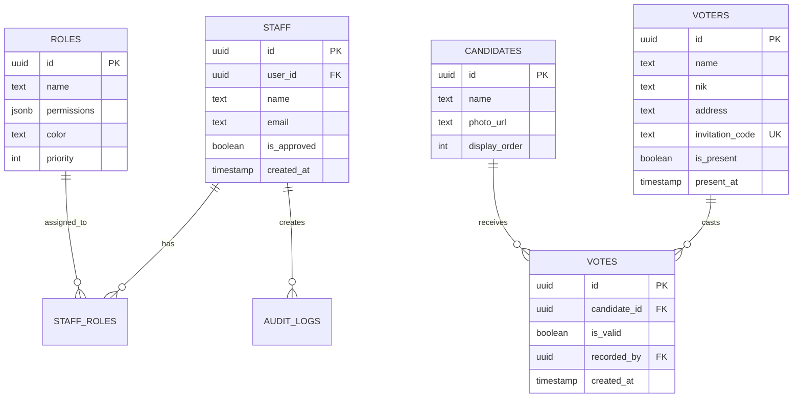

# APRT2026 - Aplikasi Pemilu RT 12 Pelem Kidul

## 📋 Daftar Isi
- [Tentang Aplikasi](#tentang-aplikasi)
- [Fitur Utama](#fitur-utama)
- [Teknologi Stack](#teknologi-stack)
- [Arsitektur Sistem](#arsitektur-sistem)
- [Panduan Pengguna](#panduan-pengguna)
- [Role & Permissions](#role--permissions)
- [Deployment](#deployment)
- [Maintenance](#maintenance)

---

## 🎯 Tentang Aplikasi

**APRT2026** adalah sistem e-voting terintegrasi yang dirancang khusus untuk pelaksanaan pemilihan Ketua RT 12 di Pelem Kidul, Baturetno, Bantul. Aplikasi ini menyediakan solusi end-to-end untuk manajemen pemilihan, mulai dari pendaftaran pemilih, verifikasi kehadiran, hingga penghitungan suara secara real-time.

### Tujuan Utama
- ✅ Digitalisasi proses pemilihan RT untuk efisiensi dan transparansi
- ✅ Manajemen data pemilih (DPT) yang terstruktur dan aman
- ✅ Verifikasi kehadiran menggunakan QR Code
- ✅ Penghitungan suara real-time dengan dashboard live
- ✅ Audit trail lengkap untuk akuntabilitas

---

## 🚀 Fitur Utama

### 1. **Manajemen Pemilih (DPT)**
- **Import/Export Data**: Import data pemilih dari CSV atau Google Sheets
- **Smart Sync**: Sinkronisasi dua arah dengan Google Sheets
- **Privacy Mode**: NIK dan alamat disamarkan untuk pengguna tanpa izin
- **Public Access**: Daftar pemilih dapat diakses publik (dengan privacy masking)
- **Edit & Delete**: Manajemen data pemilih dengan validasi NIK
- **Auto-generate Invitation Code**: Kode undangan unik untuk setiap pemilih

### 2. **Sistem Undangan**
- **Cetak Undangan Formal**: Layout resmi dengan kop surat (3 per A4)
- **QR Code Integration**: Setiap undangan memiliki QR code unik
- **Dynamic Content**: Tanggal, waktu, dan lokasi dari settings
- **Bulk Print**: Cetak semua undangan sekaligus
- **Single Print**: Cetak undangan per pemilih dari daftar

### 3. **Check-In Pemilih**
- **QR Code Scanner**: Scan QR code dari undangan
- **Real-time Verification**: Validasi instant dengan feedback audio
- **Duplicate Prevention**: Cegah check-in ganda
- **Recent History**: Log 10 check-in terakhir
- **Lock/Unlock**: Admin dapat menutup check-in saat pemilihan selesai

### 4. **Penghitungan Suara**
- **Manual Input**: Input perolehan suara per kandidat
- **Suara Sah/Tidak Sah**: Tracking suara valid dan invalid
- **Real-time Update**: Dashboard live update otomatis
- **Audit Trail**: Log semua aktivitas penghitungan

### 5. **Live Dashboard**
- **Public Display**: Dashboard untuk TV/monitor publik
- **Real-time Stats**: Update otomatis tanpa refresh
- **Responsive Design**: Optimal untuk berbagai ukuran layar
- **Print-ready**: Layout khusus untuk cetak laporan
- **Dynamic Info**: Tanggal, hari, waktu, dan lokasi dari settings

### 6. **Manajemen Tim & Roles**
- **User Registration**: Pendaftaran petugas dengan approval workflow
- **Role-Based Access Control (RBAC)**: 4 role dengan permissions granular
- **Staff Approval**: Admin approve/reject pendaftaran petugas baru
- **Self-Edit Profile**: Petugas dapat edit nama sendiri
- **Password Reset**: Reset password via email
- **Activity Logs**: Audit trail semua aktivitas staff

### 7. **Settings & Configuration**
- **Election Config**: Tanggal, waktu, lokasi pemilihan
- **Registration Toggle**: Buka/tutup pendaftaran check-in
- **Candidate Management**: Tambah/edit kandidat
- **Real-time Sync**: Perubahan settings langsung tersinkronisasi

---

## 🛠 Teknologi Stack

### Frontend
- **Framework**: Next.js 14 (App Router)
- **Language**: TypeScript
- **Styling**: Tailwind CSS
- **UI Components**: shadcn/ui
- **Icons**: Lucide React
- **QR Code**: qrcode.react

### Backend
- **Database**: PostgreSQL (Supabase)
- **Authentication**: Supabase Auth
- **Real-time**: Supabase Realtime
- **Row Level Security**: PostgreSQL RLS
- **Edge Functions**: Supabase Edge Functions (planned)

### Infrastructure
- **Hosting**: Vercel (Frontend)
- **Database**: Supabase Cloud
- **Version Control**: Git + GitHub
- **CI/CD**: Vercel Auto-deploy

---

## 🏗 Arsitektur Sistem

### Database Schema



### Permission Matrix

| Permission | Super Admin | Administrator | Controller | Officer |
|------------|-------------|---------------|------------|---------|
| all | ✅ | ❌ | ❌ | ❌ |
| manage_staff | ✅ | ✅ | ❌ | ❌ |
| manage_roles | ✅ | ✅ | ❌ | ❌ |
| manage_voters | ✅ | ✅ | ✅ | ❌ |
| manage_votes | ✅ | ✅ | ✅ | ❌ |
| manage_invitations | ✅ | ✅ | ✅ | ❌ |
| manage_settings | ✅ | ✅ | ❌ | ❌ |
| view_logs | ✅ | ✅ | ❌ | ❌ |
| check_in | ✅ | ✅ | ✅ | ✅ |
| mark_presence | ✅ | ✅ | ✅ | ✅ |

---

## 📖 Panduan Pengguna

### Untuk Publik (Tanpa Login)

#### 1. Melihat Daftar Pemilih
1. Buka aplikasi di browser
2. Klik menu **"Daftar Pemilih"**
3. Data pemilih ditampilkan dengan:
   - Nama lengkap (visible)
   - NIK disamarkan (contoh: `123********45`)
   - Alamat disembunyikan
4. Gunakan search untuk mencari nama/NIK

#### 2. Melihat Live Dashboard
1. Klik menu **"Dashboard"**
2. Lihat hasil penghitungan suara real-time
3. Dashboard update otomatis setiap ada perubahan

### Untuk Petugas (Setelah Login)

#### 1. Registrasi Petugas Baru
1. Klik **"Daftar Petugas"** di homepage
2. Isi form:
   - Nama Lengkap
   - Email
   - Password
3. Klik **"Daftar"**
4. Konfirmasi email yang dikirim ke inbox
5. Tunggu approval dari Administrator
6. Setelah diapprove, login dengan email & password

#### 2. Manajemen Data Pemilih

**Import dari CSV:**
1. Login sebagai Controller/Admin
2. Buka **"Data Pemilih"**
3. Klik **"Import CSV"**
4. Upload file CSV dengan format:
   ```csv
   name,nik,address
   Ahmad Santoso,3301012345670001,Jl. Mawar No. 10
   ```
5. Klik **"Import"**

**Sync dengan Google Sheets:**
1. Klik **"Google Sheets"**
2. Paste URL Google Sheets
3. Pilih mode sync:
   - **Smart Sync**: Dua arah (app ↔ sheets)
   - **Overwrite**: Timpa data app dengan sheets
4. Klik **"Sync Now"**

**Edit Data Pemilih:**
1. Klik icon **Edit** (pensil) pada kartu pemilih
2. Edit nama atau alamat (NIK locked)
3. Klik **"Simpan"**

#### 3. Cetak Undangan

**Cetak Semua:**
1. Buka **"Cetak Undangan"**
2. Klik **"Cetak 3 Undangan"** (print all)
3. Di print preview, pastikan:
   - Layout: Portrait
   - Margins: None
   - Scale: 100%
4. Cetak ke printer atau Save as PDF

**Cetak Per Pemilih:**
1. Buka **"Data Pemilih"**
2. Klik **"Cetak"** pada kartu pemilih
3. Print preview akan menampilkan 1 undangan
4. Cetak

#### 4. Check-In Pemilih
1. Login sebagai Officer/Controller
2. Buka **"Check-In"**
3. Arahkan kamera ke QR code undangan
4. Sistem akan:
   - ✅ Validasi kode undangan
   - ✅ Cek duplikasi
   - ✅ Tandai kehadiran
   - ✅ Tampilkan feedback (sukses/gagal)
5. Pemilih yang sudah check-in dapat mengambil surat suara

#### 5. Penghitungan Suara
1. Login sebagai Controller/Admin
2. Buka **"Hitung Suara"**
3. Input jumlah suara per kandidat
4. Input jumlah suara tidak sah
5. Klik **"Simpan"**
6. Dashboard live akan update otomatis

#### 6. Manajemen Tim (Admin Only)

**Approve Petugas Baru:**
1. Login sebagai Administrator
2. Buka **"Manajemen Tim"**
3. Tab **"User Manager"**
4. Lihat daftar pending approval
5. Klik **"Approve"** atau **"Reject"**

**Assign Role:**
1. Pilih staff dari daftar
2. Klik **"Edit"**
3. Pilih role yang sesuai
4. Klik **"Simpan"**

**Reset Password:**
1. Pilih staff
2. Klik **"Reset Password"**
3. Email reset akan dikirim ke staff

#### 7. Settings (Admin Only)
1. Buka **"Pengaturan"**
2. Edit:
   - Tanggal pemilihan
   - Waktu mulai & selesai
   - Lokasi detail
   - Status pendaftaran (buka/tutup)
3. Klik **"Simpan"**
4. Perubahan langsung tersinkronisasi ke semua halaman

---

## 🔐 Role & Permissions

### Super Admin
- **Access**: Full system access
- **Permissions**: Semua permissions (`all: true`)
- **Use Case**: System administrator, developer

### Administrator
- **Access**: Manajemen penuh kecuali system config
- **Permissions**: 
  - manage_staff, manage_roles
  - manage_voters, manage_votes
  - manage_settings, view_logs
- **Use Case**: Ketua panitia, koordinator

### Controller
- **Access**: Operasional pemilihan
- **Permissions**:
  - manage_voters, manage_votes
  - manage_invitations
  - check_in, mark_presence
- **Use Case**: Petugas lapangan senior

### Officer
- **Access**: Check-in only
- **Permissions**:
  - check_in, mark_presence
- **Use Case**: Petugas check-in di TPS

---

## 🚢 Deployment

### Prerequisites
- Node.js 18+
- Supabase Account
- Vercel Account (optional)

### Environment Variables
```env
NEXT_PUBLIC_SUPABASE_URL=your_supabase_url
NEXT_PUBLIC_SUPABASE_ANON_KEY=your_supabase_anon_key
```

### Database Setup
1. Buat project di Supabase
2. Jalankan `schema.sql` di SQL Editor
3. Verify tables & RLS policies

### Deploy to Vercel
1. Push code ke GitHub
2. Import project di Vercel
3. Set environment variables
4. Deploy

### Local Development
```bash
# Install dependencies
npm install

# Run development server
npm run dev

# Build for production
npm run build

# Start production server
npm start
```

---

## 🔧 Maintenance

### Database Cleanup
Gunakan `clean_database.sql` untuk reset data:
```sql
-- Menghapus semua data kecuali users & staff
-- Lihat file untuk detail
```

### Backup Data
```sql
-- Export voters
COPY (SELECT * FROM voters) TO '/path/to/backup.csv' CSV HEADER;

-- Export votes
COPY (SELECT * FROM votes) TO '/path/to/votes_backup.csv' CSV HEADER;
```

### Monitoring
- **Supabase Dashboard**: Monitor database performance
- **Vercel Analytics**: Track page views & performance
- **Audit Logs**: Review staff activities

---

## 📱 Mobile Optimization

Aplikasi fully responsive dengan optimasi khusus mobile:
- **Sidebar**: Off-screen di mobile dengan floating menu button
- **Padding**: 8px di mobile, 2rem di desktop
- **Touch-friendly**: Tombol dan card size optimal untuk touch
- **QR Scanner**: Native camera access di mobile browser

---

## 🎨 Design System

### Colors
- **Primary**: Blue (`#3b82f6`)
- **Success**: Emerald (`#10b981`)
- **Error**: Rose (`#f43f5e`)
- **Warning**: Amber (`#f59e0b`)

### Typography
- **Font**: Inter (Google Fonts)
- **Headings**: Font-black, tracking-tight
- **Body**: Font-medium

### Components
- **Cards**: Rounded-3xl, shadow-xl
- **Buttons**: Rounded-2xl, font-bold
- **Inputs**: Rounded-xl, border-slate-200

---

## 📞 Support

**Developer**: Ashvin Labs  
**Project**: APRT2026  
**Year**: 2026  

---

## 📄 License

© 2026 Panitia Pemilu RT 12 Pelem Kidul - Baturetno  
Designed and developed by **Ashvin Labs**
