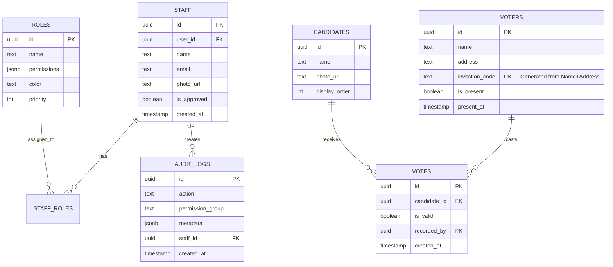

# APRT2026 - Aplikasi Pemilu RT 12 Pelem Kidul

## 📋 Daftar Isi
- [Tentang Aplikasi](#tentang-aplikasi)
- [Fitur Utama](#fitur-utama)
- [Teknologi Stack](#teknologi-stack)
- [Arsitektur Sistem](#arsitektur-sistem)
- [Panduan Pengguna](#panduan-pengguna)
- [Role & Permissions](#role--permissions)
- [Deployment](#deployment)
- [Maintenance](#maintenance)

---

## 🎯 Tentang Aplikasi

**APRT2026** adalah sistem e-voting terintegrasi yang dirancang khusus untuk pelaksanaan pemilihan Ketua RT 12 di Pelem Kidul, Baturetno, Bantul. Aplikasi ini menyediakan solusi end-to-end untuk manajemen pemilihan, mulai dari pendaftaran pemilih, verifikasi kehadiran, hingga penghitungan suara secara real-time.

### Tujuan Utama
- ✅ Digitalisasi proses pemilihan RT untuk efisiensi dan transparansi
- ✅ Manajemen data pemilih (DPT) yang terstruktur dan aman
- ✅ Verifikasi kehadiran menggunakan QR Code
- ✅ Penghitungan suara real-time dengan dashboard live
- ✅ Audit trail lengkap untuk akuntabilitas

---

## 🚀 Fitur Utama

### 1. **Manajemen Pemilih (DPT) - Privacy First**
- **Composite Identity**: Identifikasi pemilih menggunakan kombinasi **Nama + Alamat** eksak (NIK telah dihapus untuk keamanan data).
- **Import/Export Data**: Import data pemilih dari CSV atau Google Sheets dengan validasi duplikasi otomatis.
- **Smart Sync**: Sinkronisasi dua arah yang cerdas antara aplikasi dan Google Sheets.
- **Privacy Mode**: Alamat disamarkan (`[Alamat Dirahasiakan]`) untuk pengguna tanpa izin `manage_voters`.
- **Public Access**: Daftar pemilih dapat diakses publik dengan enkripsi/masking pada data sensitif.
- **Deterministic Invitation Code**: Kode 6-karakter unik dihasilkan dari data identitas untuk verifikasi fisik.

### 2. **Sistem Undangan & Cetak**
- **Cetak Formal**: Layout resmi dengan kop surat, dioptimalkan untuk 3 undangan per lembar A4.
- **QR Code Verification**: Setiap undangan memuat QR code yang memetakan ke ID pemilih di database.
- **Dynamic Content**: Data tanggal, waktu, dan lokasi diambil secara real-time dari konfigurasi sistem.
- **Bulk & Single Print**: Opsi untuk mencetak seluruh DPT atau kartu undangan individu.

### 3. **Check-In Pemilih (Registrasi)**
- **QR Code Scanner**: Pemindaian cepat melalui kamera native perangkat.
- **Real-time Validation**: Validasi status kehadiran instant dengan feedback audio (Sound FX).
- **Duplicate Prevention**: Sistem mencegah satu kode undangan digunakan lebih dari satu kali.
- **Activity History**: Log 10 riwayat check-in terakhir ditampilkan di sidebar untuk monitoring.
- **Registration Lock**: Kemampuan admin untuk menutup akses check-in seketika saat pemilihan dimulai.

### 4. **Penghitungan Suara (Tally Interface)**
- **Voting Safeguards**: Validasi sistem untuk memastikan total suara (sah + tidak sah) tidak melebihi jumlah kehadiran fisik.
- **Voting Lock**: Tally hanya dapat dimulai jika status voting telah di-set ke "Tertutup" di pengaturan.
- **Counter Mode**: Mode input cepat menggunakan tombol angka keyboard (Hotkeys 1-9) untuk produktivitas tinggi.
- **Undo Logic**: Fitur pembatalan entri terakhir untuk mengoreksi kesalahan manusia saat input.
- **Real-time Stats**: Grafik dan perolehan suara diperbarui secara instan via Supabase Realtime.

### 5. **Live Dashboard & Display**
- **Public Display**: Tampilan visual yang premium untuk tayangan TV/Monitor di lokasi pemilihan.
- **Winner Prediction**: Highlight otomatis untuk kandidat dengan suara terbanyak.
- **Responsivitas Tinggi**: Layout beradaptasi otomatis antara mode Monitor/Projector dan perangkat mobile.

### 6. **Manajemen Tim & Keamanan**
- **Staff Profile Photos**: Fitur unggah dan potong (crop) foto profil staff untuk identitas visual.
- **Registration Notifications**: Notifikasi email otomatis ke seluruh **Super Admin** saat ada petugas baru yang mendaftar.
- **RBAC (Role-Based Access Control)**: 4 level akses mulai dari Officer hingga Super Admin.
- **Approval Workflow**: Staff baru yang mendaftar harus disetujui secara manual oleh Administrator.
- **Comprehensive Audit Logs**: Pencatatan setiap aksi sensitif (Check-in, Input Suara, Edit Data) dengan metadata lengkap.

### 7. **Settings & Global Configuration**
- **Election Meta**: Konfigurasi nama acara, tanggal, jam operasional, dan lokasi.
- **Operational Toggles**: Switch global untuk membuka/menutup registrasi dan mulai/berhenti penghitungan suara.
- **Candidate Management**: Pengelolaan foto, nama, dan nomor urut kandidat.

---

## 🛠 Teknologi Stack

### Frontend
- **Framework**: Next.js 14 (App Router)
- **Language**: TypeScript
- **Styling**: Tailwind CSS
- **UI Components**: shadcn/ui
- **Icons**: Lucide React
- **QR Code**: qrcode.react

### Backend
- **Database**: PostgreSQL (Supabase)
- **Authentication**: Supabase Auth
- **Real-time**: Supabase Realtime
- **Row Level Security**: PostgreSQL RLS
- **Edge Functions**: Supabase Edge Functions (planned)

### Infrastructure
- **Hosting**: Vercel (Frontend)
- **Database**: Supabase Cloud
- **Version Control**: Git + GitHub
- **CI/CD**: Vercel Auto-deploy

---

## 🏗 Arsitektur Sistem

### Database Schema



### Permission Matrix

| Permission | Super Admin | Administrator | Controller | Officer |
|------------|-------------|---------------|------------|---------|
| all | ✅ | ❌ | ❌ | ❌ |
| manage_staff | ✅ | ✅ | ❌ | ❌ |
| manage_roles | ✅ | ✅ | ❌ | ❌ |
| manage_voters | ✅ | ✅ | ✅ | ❌ |
| manage_votes | ✅ | ✅ | ✅ | ❌ |
| manage_invitations | ✅ | ✅ | ✅ | ❌ |
| manage_settings | ✅ | ✅ | ❌ | ❌ |
| view_logs | ✅ | ✅ | ❌ | ❌ |
| check_in | ✅ | ✅ | ✅ | ✅ |
| mark_presence | ✅ | ✅ | ✅ | ✅ |

---

## 📖 Panduan Pengguna

### Untuk Publik (Tanpa Login)

#### 1. Melihat Daftar Pemilih
1. Buka aplikasi di browser
2. Klik menu **"Daftar Pemilih"**
3. Data pemilih ditampilkan dengan:
   - Nama lengkap (visible)
   - NIK disamarkan (contoh: `123********45`)
   - Alamat disembunyikan
4. Gunakan search untuk mencari nama/NIK

#### 2. Melihat Live Dashboard
1. Klik menu **"Dashboard"**
2. Lihat hasil penghitungan suara real-time
3. Dashboard update otomatis setiap ada perubahan

### Untuk Petugas (Setelah Login)

#### 1. Registrasi Petugas Baru
1. Klik **"Daftar Petugas"** di homepage
2. Isi form:
   - Nama Lengkap
   - Email
   - Password
3. Klik **"Daftar"**
4. Konfirmasi email yang dikirim ke inbox
5. Tunggu approval dari Administrator
6. Setelah diapprove, login dengan email & password

#### 2. Manajemen Data Pemilih

**Import dari CSV:**
1. Login sebagai Controller/Admin
2. Buka **"Data Pemilih"**
3. Klik **"Import CSV"**
4. Upload file CSV dengan format:
   ```csv
   name,nik,address
   Ahmad Santoso,3301012345670001,Jl. Mawar No. 10
   ```
5. Klik **"Import"**

**Sync dengan Google Sheets:**
1. Klik **"Google Sheets"**
2. Paste URL Google Sheets
3. Pilih mode sync:
   - **Smart Sync**: Dua arah (app ↔ sheets)
   - **Overwrite**: Timpa data app dengan sheets
4. Klik **"Sync Now"**

**Edit Data Pemilih:**
1. Klik icon **Edit** (pensil) pada kartu pemilih
2. Edit nama atau alamat (NIK locked)
3. Klik **"Simpan"**

#### 3. Cetak Undangan

**Cetak Semua:**
1. Buka **"Cetak Undangan"**
2. Klik **"Cetak 3 Undangan"** (print all)
3. Di print preview, pastikan:
   - Layout: Portrait
   - Margins: None
   - Scale: 100%
4. Cetak ke printer atau Save as PDF

**Cetak Per Pemilih:**
1. Buka **"Data Pemilih"**
2. Klik **"Cetak"** pada kartu pemilih
3. Print preview akan menampilkan 1 undangan
4. Cetak

#### 4. Check-In Pemilih
1. Login sebagai Officer/Controller
2. Buka **"Check-In"**
3. Arahkan kamera ke QR code undangan
4. Sistem akan:
   - ✅ Validasi kode undangan
   - ✅ Cek duplikasi
   - ✅ Tandai kehadiran
   - ✅ Tampilkan feedback (sukses/gagal)
5. Pemilih yang sudah check-in dapat mengambil surat suara

#### 5. Penghitungan Suara (Tally)
1. Login sebagai Controller/Admin.
2. Pastikan Status Voting telah di-set ke **"Tertutup"** di menu Pengaturan.
3. Buka **"Hitung Suara"**.
4. **Counter Mode (Rekomendasi)**:
   - Tekan tombol `[K]` atau klik switch **"Mode Cepat"**.
   - Gunakan tombol angka `1`, `2`, `3`, dst sesuai nomor urut kandidat untuk input suara +1.
   - Tekan `0` atau `X` untuk suara tidak sah.
   - Tekan `Backspace` atau `U` untuk membatalkan (Undo) entri terakhir jika terjadi kesalahan.
5. **Manual Mode**: Klik pada kartu kandidat untuk menambah suara.
6. Dashboard live akan diperbarui secara real-time.

#### 6. Manajemen Tim & Foto Profil (Admin Only)

**Update Foto Profil:**
1. Login sebagai staff.
2. Buka **"Manajemen Tim"** atau menu profil.
3. Klik icon **Kamera** pada avatar petugas.
4. Pilih foto, lakukan **Crop** agar sesuai, lalu simpan.

**Approve Petugas Baru:**
1. Login sebagai Administrator.
2. Buka **"Manajemen Tim"**.
3. Lihat daftar pendatang baru, klik **"Approve"**.
4. Assign role yang sesuai agar petugas memiliki izin akses.

**Assign Role:**
1. Pilih staff dari daftar
2. Klik **"Edit"**
3. Pilih role yang sesuai
4. Klik **"Simpan"**

**Reset Password:**
1. Pilih staff
2. Klik **"Reset Password"**
3. Email reset akan dikirim ke staff

#### 7. Settings (Admin Only)
1. Buka **"Pengaturan"**
2. Edit:
   - Tanggal pemilihan
   - Waktu mulai & selesai
   - Lokasi detail
   - Status pendaftaran (buka/tutup)
3. Klik **"Simpan"**
4. Perubahan langsung tersinkronisasi ke semua halaman

---

## 🔐 Role & Permissions

Sistem menggunakan model **5-Role** yang dirancang untuk memisahkan tanggung jawab antara manajemen, operasional registrasi (depan), dan operasional penghitungan (belakang).

### 1. Struktur Role

#### A. High-Level Management
| Role | Tanggung Jawab | Deskripsi |
| :--- | :--- | :--- |
| **Super Admin** | System Owner | Akses penuh untuk developer/IT. Maintenance database, debugging, dan perbaikan data level rendah. |
| **Administrator** | Election Chairman | "Ketua Panitia". Mengelola user/staff, menyetujui pendaftaran petugas baru, mengubah konfigurasi vital (Waktu/Lokasi), dan melihat laporan akhir. |

#### B. Operational Field Roles
| Role | Tanggung Jawab | Deskripsi |
| :--- | :--- | :--- |
| **Supervisor** | Field Ops Lead | "Koordinator Lapangan". Menangani kasus khusus (undangan hilang, salah nama). Memiliki hak untuk **Cetak Ulang Undangan** dan memantau jalannya Tally. |
| **Tally Officer** | Vote Inputter | "Petugas Operator Laptop". **Fungsi Tunggal**: Input data suara (Tombol 1-9) saat penghitungan. Tidak bisa melihat alamat pemilih atau mengubah setting. |
| **Officer** | Greeter/Check-in | "Petugas Registrasi". Bertugas scan QR Code di pintu masuk. Hanya bisa verifikasi Nama vs KTP. **Privacy**: Tidak bisa melihat alamat detail pemilih. |

### 2. Permission Matrix

Tabel berikut mengatur hak akses untuk setiap permission key dalam sistem:

| Permission Key | Deskripsi | Super Admin | Administrator | Supervisor | Tally Officer | Officer |
| :--- | :--- | :---: | :---: | :---: | :---: | :---: |
| `all` | Akses Root (Bahaya) | ✅ | ❌ | ❌ | ❌ | ❌ |
| `manage_settings` | Buka/Tutup Voting | ✅ | ✅ | ❌ | ❌ | ❌ |
| `manage_staff` | Approve/Edit Staff | ✅ | ✅ | ❌ | ❌ | ❌ |
| `manage_roles` | Edit Struktur Role | ✅ | ✅ | ❌ | ❌ | ❌ |
| `view_logs` | Lihat Audit Trail | ✅ | ✅ | ✅ | ❌ | ❌ |
| `manage_invitations` | Print/Reprint Undangan | ✅ | ✅ | ✅ | ❌ | ❌ |
| `manage_voters` | Edit Nama/Alamat | ✅ | ✅ | ✅ | ❌ | ❌ |
| `manage_votes` | **Input Suara (Tally)** | ✅ | ✅ | ✅ | ✅ | ❌ |
| `undo_vote` | **Hapus Suara Terakhir** | ✅ | ✅ | ✅ | ✅* | ❌ |
| `check_in` | Scan QR (Masuk) | ✅ | ✅ | ✅ | ❌ | ✅ |
| `view_dashboard` | Lihat Hasil Live | ✅ | ✅ | ✅ | ✅ | ✅ |

*\*Tally Officer hanya dapat membatalkan suara yang baru saja mereka input sendiri (untuk koreksi typo).*

### 3. Audit Logging & Traceability

Untuk menjamin keamanan dan akuntabilitas data (Non-repudiation), sistem menerapkan strategi logging berlapis:

#### Layer 1: Application Logs
Setiap aksi di antarmuka (UI) akan dicatat oleh fungsi `logActivity()` dengan metadata lengkap (Siapa, Kapan, Apa, IP).
- **Check-in**: Mencatat ID petugas yang melakukan scan.
- **Vote Input**: Mencatat ID petugas tally untuk setiap suara.
- **Data Change**: Mencatat nilai lama vs nilai baru (Diff) saat edit nama/alamat.

#### Layer 2: Database Triggers (Infallible)
Trigger database otomatis aktif pada operasi Low-Level (`INSERT`, `UPDATE`, `DELETE`) di tabel kritis:
- `voters`
- `votes`
- `settings`
- `staff`

Ini memastikan bahwa meskipun seseorang mencoba memanipulasi data langsung melalui API (By-pass UI), jejaknya akan tetap terekam di tabel `audit_logs` yang tidak dapat dihapus (Append-Only).

---

## 🚢 Deployment

### Prerequisites
- Node.js 18+
- Supabase Account
- Vercel Account (optional)

### Environment Variables
```env
NEXT_PUBLIC_SUPABASE_URL=your_supabase_url
NEXT_PUBLIC_SUPABASE_ANON_KEY=your_supabase_anon_key
```

### Database Setup
1. Buat project di Supabase
2. Jalankan `schema.sql` di SQL Editor
3. Verify tables & RLS policies

### Deploy to Vercel
1. Push code ke GitHub
2. Import project di Vercel
3. Set environment variables
4. Deploy

### Local Development
```bash
# Install dependencies
npm install

# Run development server
npm run dev

# Build for production
npm run build

# Start production server
npm start
```

---

## 🔧 Maintenance

### Database Cleanup
Gunakan `clean_database.sql` untuk reset data:
```sql
-- Menghapus semua data kecuali users & staff
-- Lihat file untuk detail
```

### Backup Data
```sql
-- Export voters
COPY (SELECT * FROM voters) TO '/path/to/backup.csv' CSV HEADER;

-- Export votes
COPY (SELECT * FROM votes) TO '/path/to/votes_backup.csv' CSV HEADER;
```

### Monitoring
- **Supabase Dashboard**: Monitor database performance
- **Vercel Analytics**: Track page views & performance
- **Audit Logs**: Review staff activities

---

## 📱 Mobile Optimization

Aplikasi fully responsive dengan optimasi khusus mobile:
- **Sidebar**: Off-screen di mobile dengan floating menu button
- **Padding**: 8px di mobile, 2rem di desktop
- **Touch-friendly**: Tombol dan card size optimal untuk touch
- **QR Scanner**: Native camera access di mobile browser

---

## 🎨 Design System

### Colors
- **Primary**: Blue (`#3b82f6`)
- **Success**: Emerald (`#10b981`)
- **Error**: Rose (`#f43f5e`)
- **Warning**: Amber (`#f59e0b`)

### Typography
- **Font**: Inter (Google Fonts)
- **Headings**: Font-black, tracking-tight
- **Body**: Font-medium

### Components
- **Cards**: Rounded-3xl, shadow-xl
- **Buttons**: Rounded-2xl, font-bold
- **Inputs**: Rounded-xl, border-slate-200

---

## 📞 Support

**Developer**: Ashvin Labs  
**Project**: APRT2026  
**Year**: 2026  

---

## 📄 License

© 2026 Panitia Pemilu RT 12 Pelem Kidul - Baturetno  
Designed and developed by **Ashvin Labs**
